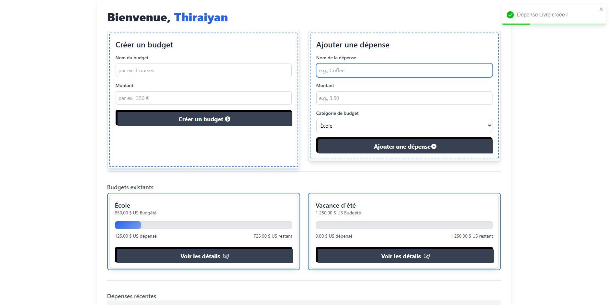

# Budget Tracking Web Application

## https://niseiyen.github.io/Personal-Finance-Tracker/

## Description
Cette application web de suivi de budget vous aide à gérer vos finances de manière efficace. Elle permet de créer des budgets, d'ajouter des dépenses et de les supprimer, tout en offrant une interface moderne et intuitive. Conçue avec React et Tailwind CSS, cette application fournit une expérience utilisateur rapide et responsive.

## Fonctionnalités principales
- **Création de budgets** : Définissez des budgets personnalisés pour suivre vos objectifs financiers.
- **Gestion des dépenses** : Ajoutez, modifiez ou supprimez des dépenses facilement.
- **Dashboard moderne** : Visualisez vos données financières avec des graphiques clairs et une interface intuitive.
- **Responsive Design** : Compatible avec les appareils mobiles, tablettes et ordinateurs.

## Technologies utilisées
- **Frontend** :
  - React.js
  - Tailwind CSS
  - JavaScript (ES6+)

## Capture décran

## Auteur
Thiraiyan Mooneesawmy

Retrouvez-moi sur :
- **LinkedIn** : https://www.linkedin.com/in/thiraiyan-mooneesawmy-99b8742b0/
- **GitHub** : https://github.com/Niseiyen

